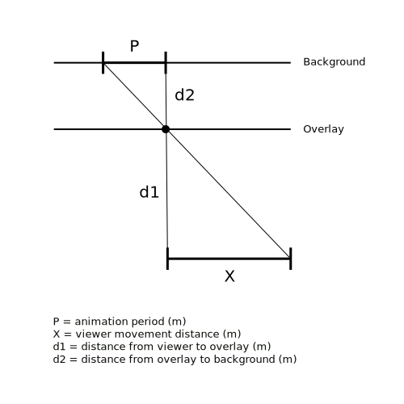

# Kinegram

## Purpose
The purpose of this library and utility is to easily and procedurally generate [kinegrams](https://en.wikipedia.org/wiki/Barrier_grid_animation_and_stereography) ( barrier grid animations) from input images with parametric control of the grid spacing and width.

Furthermore, grid spacing and width will be controllable with respect to the properties of parallax. This is to allow the creation of animations which are driven by the movement of individuals through space through leveraging the difference in movement between sufficiently space foreground and background elements.

## Basics
Based on info found at this [making kinegrams](http://thinkzone.wlonk.com/Kinegram/MakingKinegrams.htm) site.

* from the top of one solid stripe to the top of the next solid stripe must be the same as the animation cycle length

* The clear stripes should be thinner than the solid stripes.
    * Thinner clear stripes will make the kinegram appear sharper but dimmer; whereas thicker clear stripes will make the kinegram appear brighter but blurrier.


## Observations
The above information should work well for situations where the stripes are overlayed directly onto the animation image. However, if there is some distance between the stripes and image, the apparent size between the stripes and image will change.

See: https://en.wikipedia.org/wiki/Visual_angle

Likely what is most important is to maintain the equality of the total stripe (black and clear) being the same as the total animation length.

## Calculations
### Visual Angle
```
V = 2arctan(S/2D)
```
where V is the visual angle
S is the height of the object
D is the distance of the object

to compensate for a change in D (for the stripes), the `visual angle` will be kept constant, while `D` changes and so `S` must be adjusted to compensate.

since the `visual angle` is a constant for both objects:

```
S1/D1 = S2/D2
```

#### Example
Thus, an object of `0.01m` at a distance of `1m` will look to be the same size as an object of `0.02m` at a distance of `2m`.

```
0.01/1 = 0.02/2
```

#### Usage
##### Image Scaling
When prototyping an image, it should work well to test at a smaller size (single sheet of paper). Then, when scaling the image up there are two components which will have to be considered.

When the image is scaled to be larger, the distance from viewer to image will be scaled. So, for a `20x28cm` image at `1m` scaled by a factor of 10:

```
20x28/1 = 200x280/D2
D2 = 10
```

Second, the pixel width for the interference pattern will also have to be scaled. So, if a `1px` width looks good at `1m`, and the image is scaled by 10, the width will also have to be scaled by 10 (i.e. `10px` width).

##### Front-to-Back Scaling
The interference pattern is presumed to be overlayed directly over top of the image. However, for the parallax effect to work the interference pattern will be moved closer to the viewer. Thus, the pixel width will have to be increased proportional to this change of distance.

For example, if the interference pattern is `10px` at `10m` but the image is shifted toward the viewer `1m`, it will appear to be larger and the pixel width will have to be scaled:

```
10px/10m = S2/9m
S2 = 9px
```

**Note**: This pixel width will only need to be calculated once since the above scaling and the distance offset can all be considered one step. So, for the above examples, a `1px` width at `9m` will be `9px`, regardless of what stage it is calculated.

### Animation Period
The parallax effect works because of the `visual angle` effect discussed above. An object closer to the viewer moves at a different rate than one farther away. The image below gives an intuition of how relative to an object closer to the viewer (constantly kept in the centre of view) the background will move a larger amount:


For the purposes of creating an animation with a set period, the fixed point will be considered a point on the interlace image (effectively 1 of the dark pixel columns). This allows the calculation of the viewer's travel distance in relation to the period of the animation (all calculated based on distances).

The diagram below shows the relationship between the `animation period` (in meters, called `P` in the diagram) and the distance the viewer must walk (in meters, called `X` in the diagram):



The relationship of the elements above operates the same as with the `visual angle` calculations above:

```
X/D1 = P/D2
```

These 4 elements can be optimized for the strongest effect given some constraints.

**NOTE**: The period of the animation is the number of frames times the width of the interlace pattern.

#### Examples
##### Known viewer walking distance and image distances
If a viewer will have room for a `3m` viewer walking distance (x). The background image is `11m` away with the interference pattern `10m` away (i.e. background and interference pattern separated by `1m`):

```
D1 = 10
D2 = (11 - 10)
P = (X * D2) / D1
p = (3 * 1) / 10
p = 0.3m
```

**Note**: In this example, it is fairly obvious that a `9m` to `10m` distance is insufficient for an animation since the period is huge.

##### Known viewer walking distance, known animation period, known D1
If a viewer will have room for a `3m` viewer walking distance (x). The interlace image is `10m` away from the ivewer with the animation period is `.5m`:
```
D2 = (p * D1)/x
D2 = (.5 * 10)/3
D1 = 1.67m
```

## Notes
### 8.5x11 Image
An 8.5x11 inch colour image print has been tested with the following parameters:

* pixel width: 5px
* # frames: 7
* background distance: 1m
* foreground distance: 0m, .1m, .25m, .5m

The `0m` foreground distance provided a sanity check
The `.1m` and `.25m` foreground distances worked effectively.
The `.5m` distance did not work at all. It is hard to 

Additionally, the use of colour was perhaps not successful. A high contrast black/white image would likely work better.

The image tended to be very dark behind the screen. A larger `pixel width` should help increase the brightness of the image (and the animation distance for viewers).

#### Hypothesis
The is likely a relationship between `pixel width` and `# of frames` such that their ratio can be optimized.
